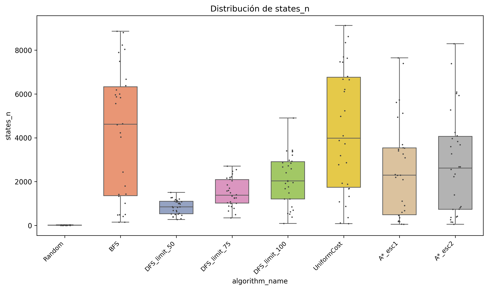
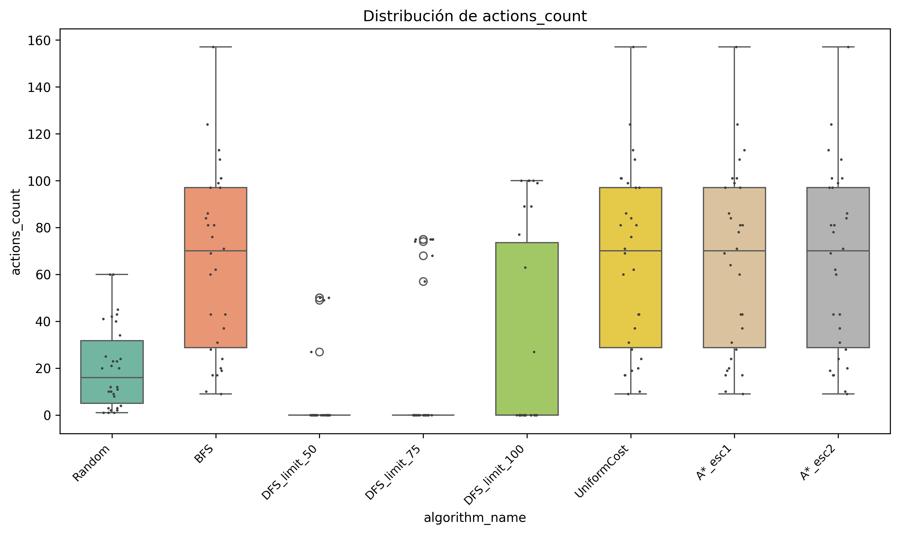
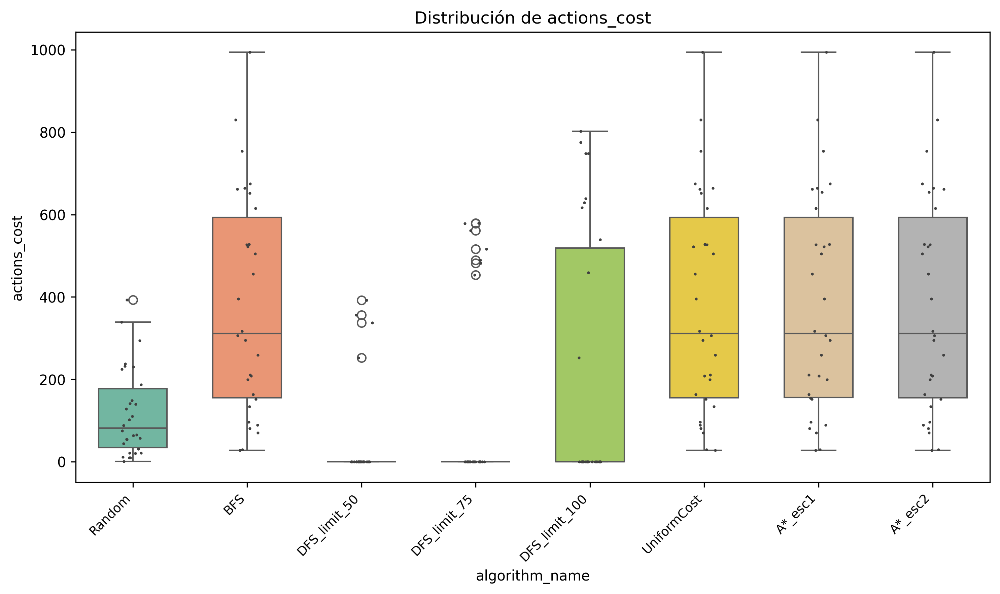
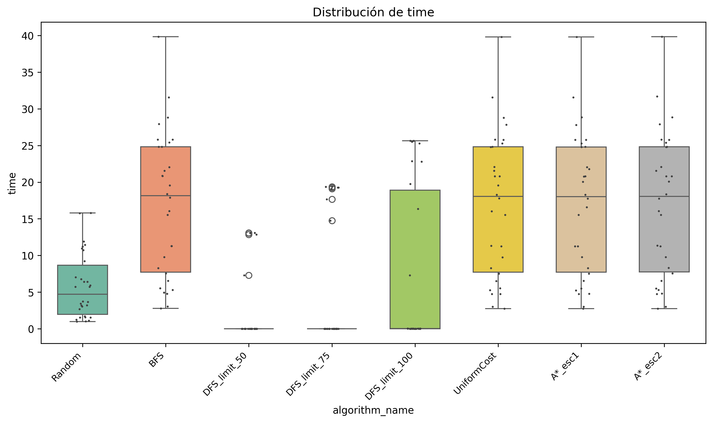
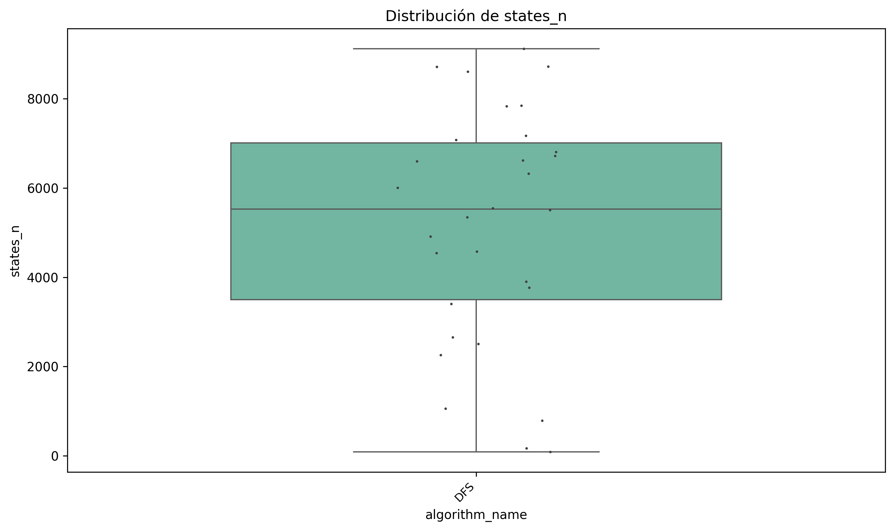
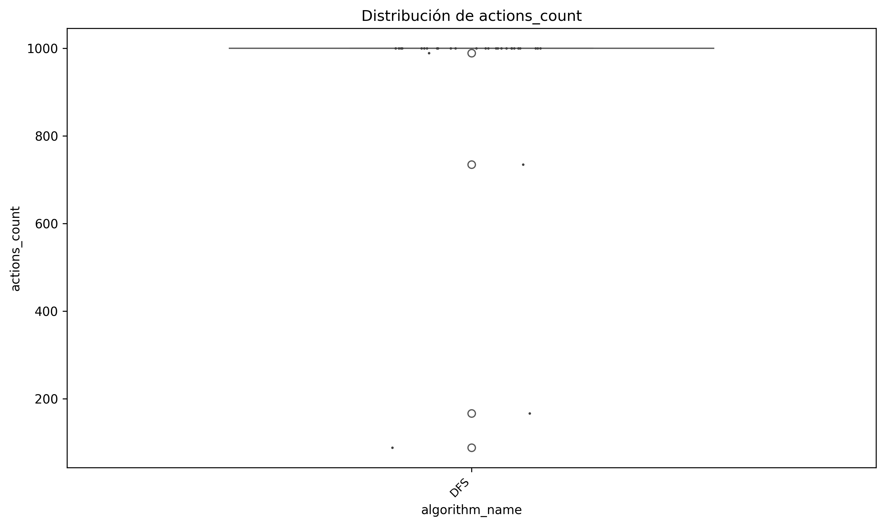
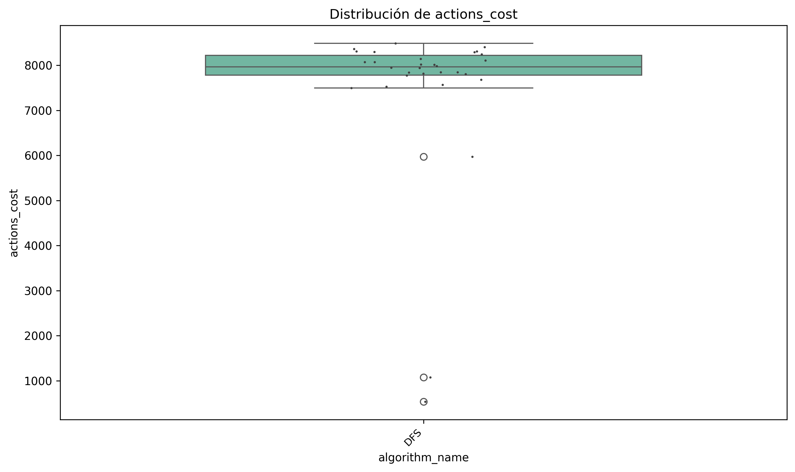
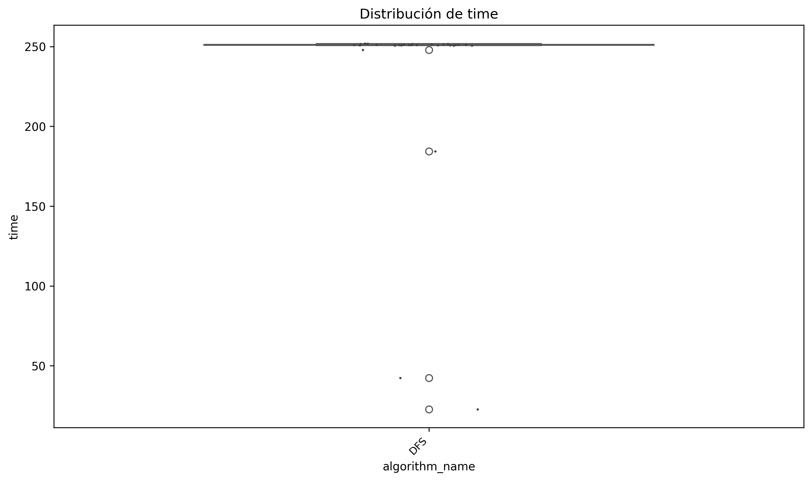
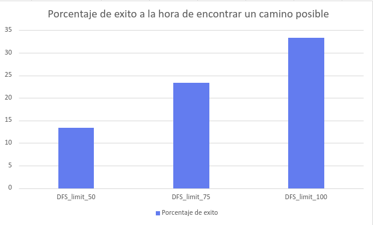

Este reporte analiza el rendimiento de distintos algoritmos de búsqueda. Se incluyen gráficos de caja y bigote que muestran métricas relevantes como estados explorados, cantidad de acciones, costo de acciones y tiempo de ejecución.

Comparación General de Algoritmos:

Estados Explorados

Este gráfico muestra la cantidad de estados explorados por cada algoritmo. Se observa que Random tiene muy poca dispersion, pero esto es porque es muy probable que muera cayendo en un agujero antes de poder explorar una buena cantidad de estados. BFS explora muchos estados debido a su naturaleza exhaustiva. DFS con límites 50, 75 y 100 muestra una mejora progresiva en cobertura, debido al aumento de su radio de busqueda. A* presenta un rendimiento superior, recorriendo menos estados que el resto para encontrar el objetivo.

Cantidad de Acciones:

Aquí se analiza la cantidad de acciones necesarias para alcanzar la solución. Todos los algoritmos exceptuando DFS_limit y Random tienen una cantidad de acciones bastante equivalente, ya que encuentran el camino optimo. Random en cambio se movera hacia cualquier direccion hasta que caiga en un agujero en la mayor parte de los casos. DFS_limit ejecuta pocas acciones, ya que no le es posible encontrar el camino en la mayoria de los casos, se hablara de esto mas adelante del reporte

Costo de Acciones

Aca pasa algo similar al numero de acciones, por lo que todos los algoritmos encontraran un camino optimo que puede llegar a diferir pequeñamente en costos. Mientras que random simplemente acumula costo moviendose sin ningun sentido, y dfs_limit al no encontrar el no ejecutara ninguna accion, haciendo que tampoco se acumule un costo.

Tiempo de Ejecución

El tiempo de ejecución es un factor clave. A*, BFS y UniformCost tienen tiempos optimos, mientras que DFS tiene dificultades para encontrar el camino que demore menos. Random muestra el tiempo que se mantuvo el agente con vida, antes de caer a un agujero.

Análisis del Algoritmo DFS

Estados Explorados por DFS:

El algoritmo DFS muestra una eficiencia limitada. Su rendimiento es generalmente pobre en comparación con otros algoritmos. Explora una gran cantidad de estados, pero esto no se traduce en soluciones efectivas. 

Rendimiento General de DFS

Los gráficos de cantidad de acciones, costo y tiempo para DFS reflejan su baja eficiencia. Aunque puede ser rápido en contados casos, generalemente la calidad de las soluciones es inferior. DFS no garantiza encontrar el camino óptimo y su rendimiento depende fuertemente del límite de profundidad.

Porcentaje de Éxito en DFS con Límite

Este gráfico muestra cómo el porcentaje de éxito mejora al aumentar el límite de profundidad en DFS Limitado. A mayor profundidad, mayor cobertura del espacio de búsqueda, lo que incrementa la probabilidad de encontrar una solución. Sin embargo, esto también puede aumentar el tiempo de ejecución y el consumo de recursos.

Conclusión

El algoritmo A* demuestra ser el más eficiente en términos de estados explorados, costo y tiempo. BFS ofrece soluciones completas pero con un mayor porcentaje de estados explorados. DFS y Random presentan limitaciones significativas. El ajuste del límite en DFS Limitado puede mejorar su rendimiento, pero no lo convierte en una solución óptima.

