## Reporte para el Trabajo Practico Nro 4: Busquedas locales

En este reporte se hablara sobre los 4 algoritmos puestos a prueba en el problema de las N-Reinas.

## Parametros

Se usaron parametros para todos los algoritmos, como el limite de estados explorados el cual fue 1000.

Para Simulated Annealing se uso una funcion de schedule geometrica, en donde t es el numero de iteracion:

```
def schedule(t):
    return 100 * (0.97 ** t)
```

El algoritmo terminara cuando el retorno de esta funcion sea menor a 10⁽⁻¹⁰⁾.

Yendo al algoritmo genetico, este empieza con una seleccion de 100 individuos de forma aleatoria (sin permutaciones), que es igual al tamaño de la poblacion. Luego se seleccionaran 3 individuos para hacer un torneo, el cual ganara el que menor pares de reina amenazadas tenga. Luego con un 80% de posibilidad, se realizara una permutacion (PMX) con los padres. Luego con un 10% de posibilidad, se realiza una mutacion. Finalmente se obtienen dos individuos los cuales seran almacenados en una nueva poblacion. Estos 4 pasos se repetiran hasta que la nueva poblacion sea de tamaño 100.

Finalmente se guarda el mejor valor de la generacion y se realiza todo el procedimiento otra vez con la nueva generacion. En este caso se realizaran un total de 10 generaciones.

El criterio de terminacion es haber encontrado la mejor solucion o llegar al numero maximo de estados explorados.

## Llegada a una solución óptima
La serie de capturas de éxito permite observar cómo evoluciona la probabilidad de alcanzar una solución óptima a medida que aumenta el tamaño del tablero en el problema de las N-Reinas. Para tableros pequeños (4x4) casi todos los algoritmos convergen rápidamente, mientras que en tamaños intermedios (8x8 y 10x10) aparecen ejecuciones fallidas producidas por mesetas o máximos locales. En el caso de 12 y 15 reinas, el impacto de la dimensionalidad se hace evidente: los métodos deterministas requieren reinicios y los estocásticos dependen del ajuste de los parámetros de exploración. Las imágenes permiten comparar visualmente estas diferencias y refuerzan la necesidad de estrategias híbridas o de reinicio cuando el espacio de búsqueda se expande.

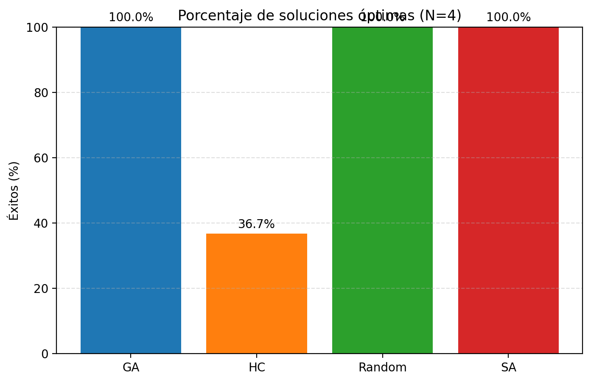
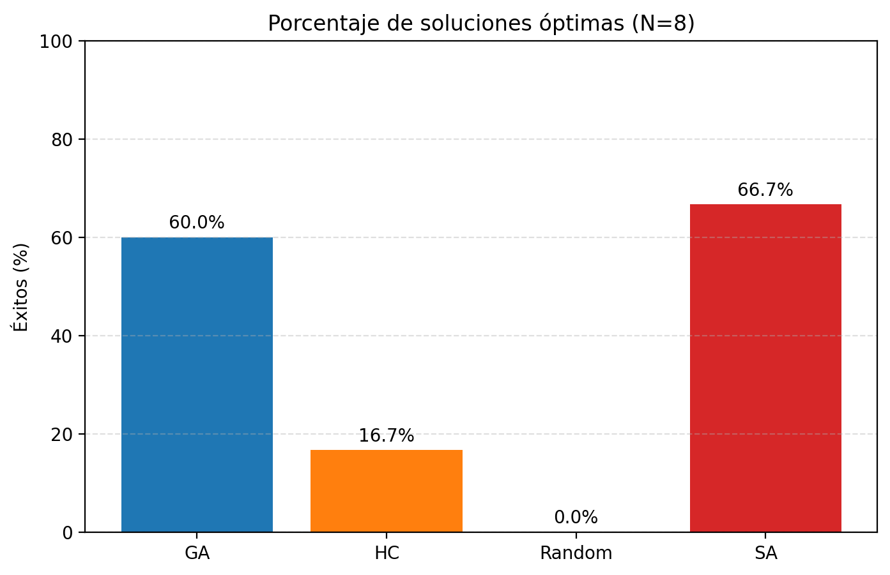
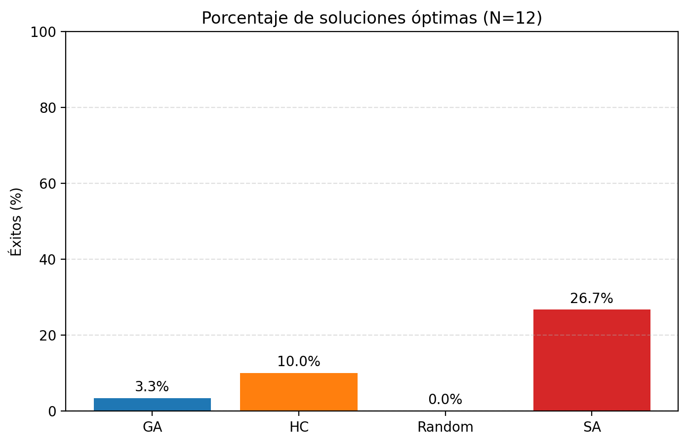
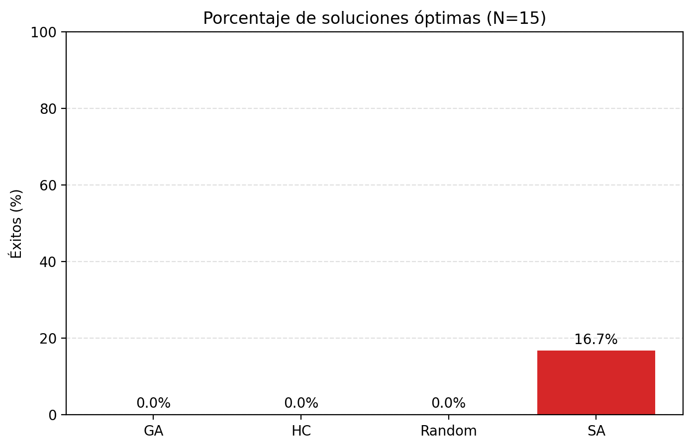

## Boxplots de desempeño
Los boxplots complementan el análisis mostrando la dispersión en tiempo, costo y cantidad de acciones para cada tamaño. Se aprecia que el incremento del tamaño del tablero amplifica tanto la mediana como la variabilidad, especialmente para los algoritmos más sensibles al valor inicial. Las colas alargadas reflejan ejecuciones que quedaron estancadas, y las cajas compactas corresponden a configuraciones en las que la heurística guiada o el enfriamiento logró escapar de máximos locales. Esta lectura por tamaño ayuda a seleccionar el algoritmo según el compromiso entre consistencia y velocidad.

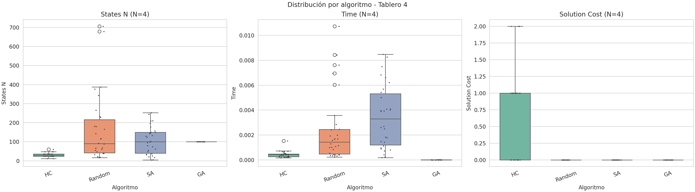
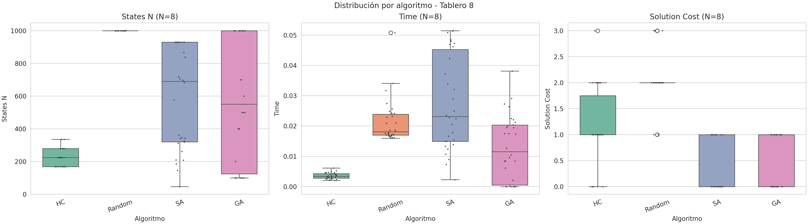
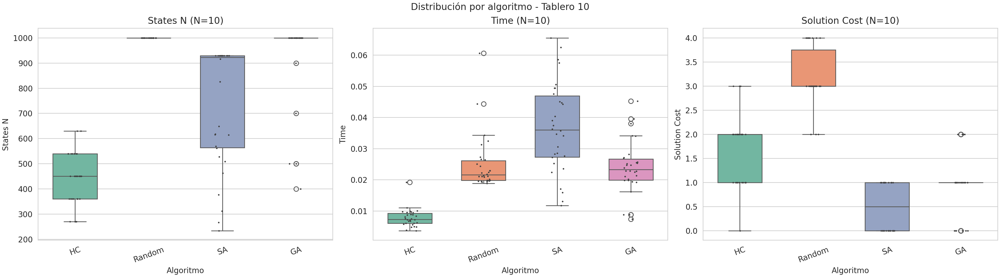
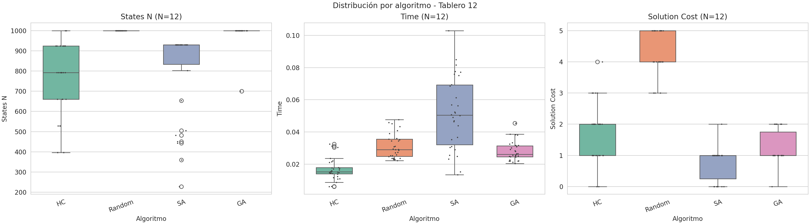

## Evolución de las funciones de fitness
Las curvas hx registran la evolución del valor de la función objetivo a lo largo de las iteraciones para cada enfoque. La búsqueda aleatoria exhibe descensos abruptos seguidos de mesetas prolongadas, mientras que el Hill Climbing con reinicios mantiene un progreso escalonado hasta estabilizarse. Simulated Annealing muestra oscilaciones controladas que reflejan su capacidad de aceptar peores movimientos al inicio, facilitando la exploración. Finalmente, el algoritmo genético combina exploración y explotación: la diversidad inicial genera variaciones pronunciadas y luego la población converge gradualmente hacia configuraciones competitivas. Comparar estas curvas permite ajustar parámetros como temperatura, tasa de mutación o criterios de reinicio para balancear exploración y convergencia.

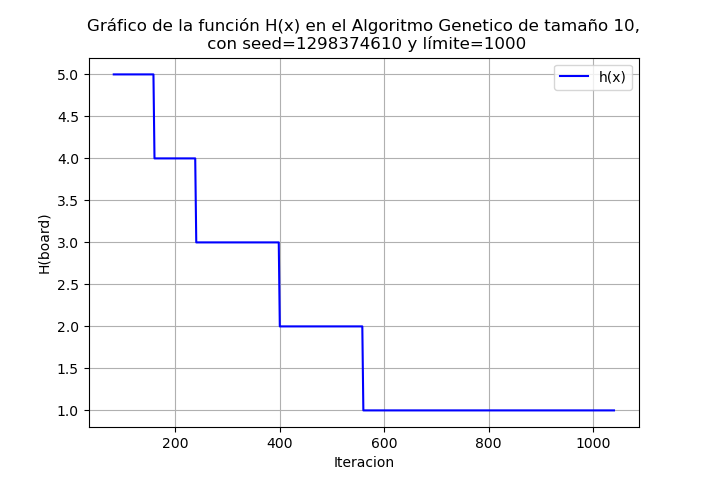
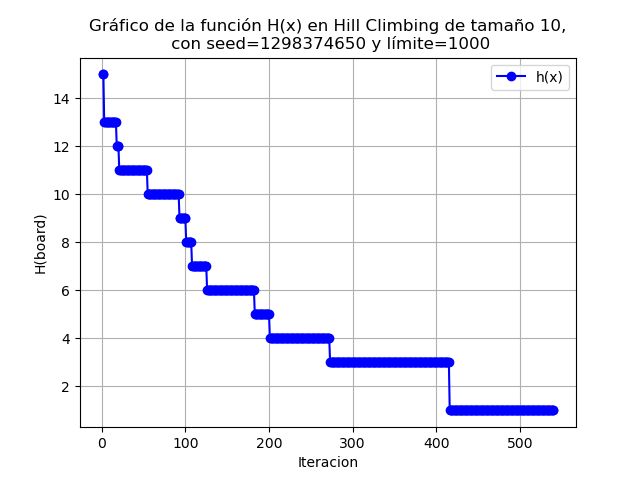
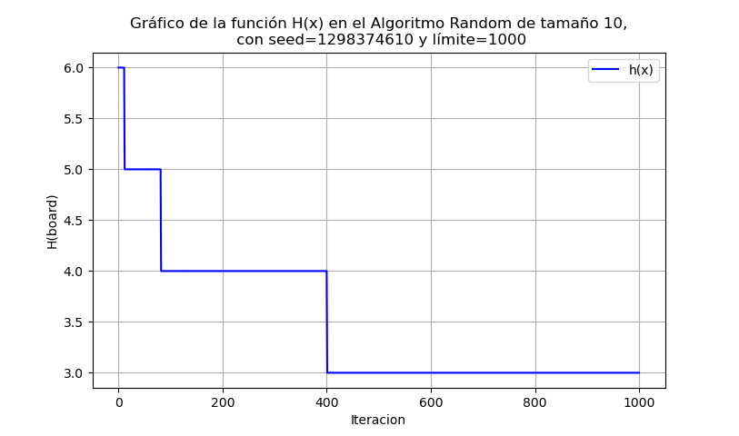
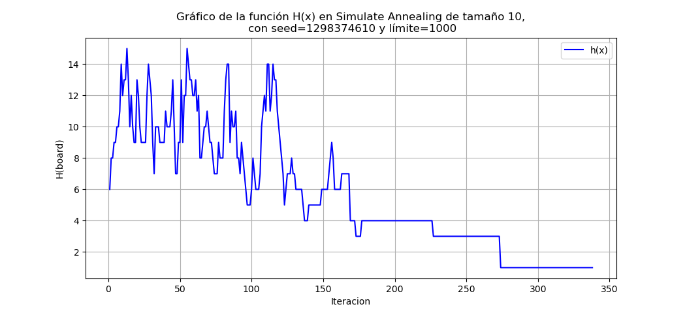

Actividad 7 (Mejor algoritmo segun mi opinion):

En mi opinión, el mejor desempeño global lo ofrece Simulated Annealing porque mantiene la mayor tasa de convergencia hacia la mejor solución aun cuando el espacio de búsqueda se vuelve grande. La tolerancia a movimientos peores durante las primeras etapas evita quedar atrapado en mesetas de la heurística y se observa en las gráficas de éxito como una fracción más alta de ejecuciones óptimas. Además, la parametrización con un esquema de enfriamiento suave permite ajustar el balance exploración-explotación sin necesidad de reinicios frecuentes. Como contrapartida, la calibración de temperatura inicial y factor de enfriamiento requiere experimentación y, si se elige un enfriamiento demasiado lento, el tiempo total de ejecución puede crecer más que en Hill Climbing; pese a ello, considero que su robustez ante máximos locales compensa ampliamente este costo.


