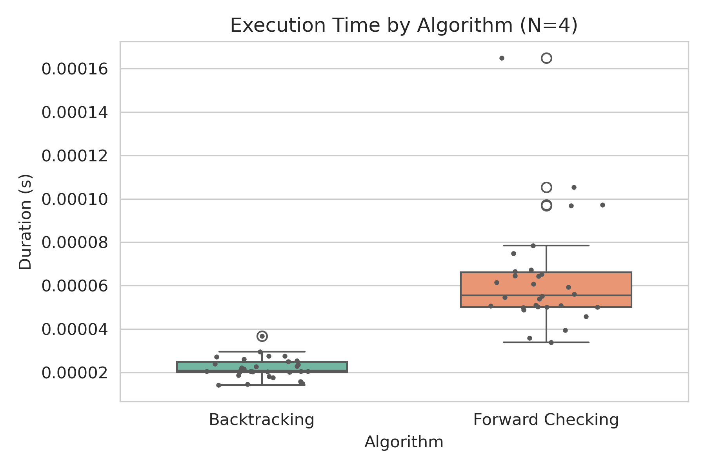
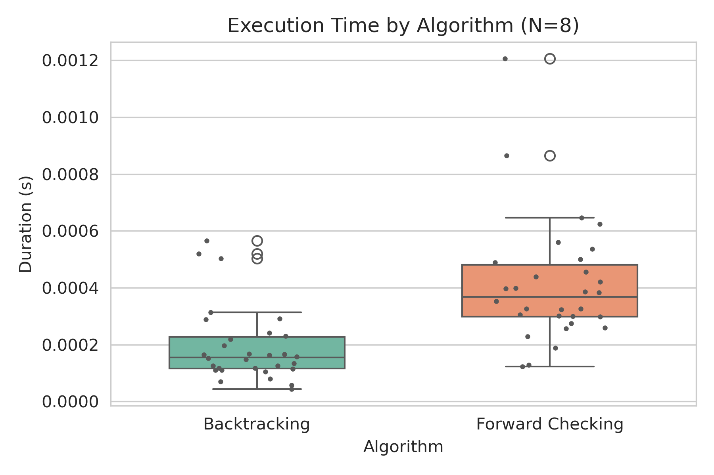
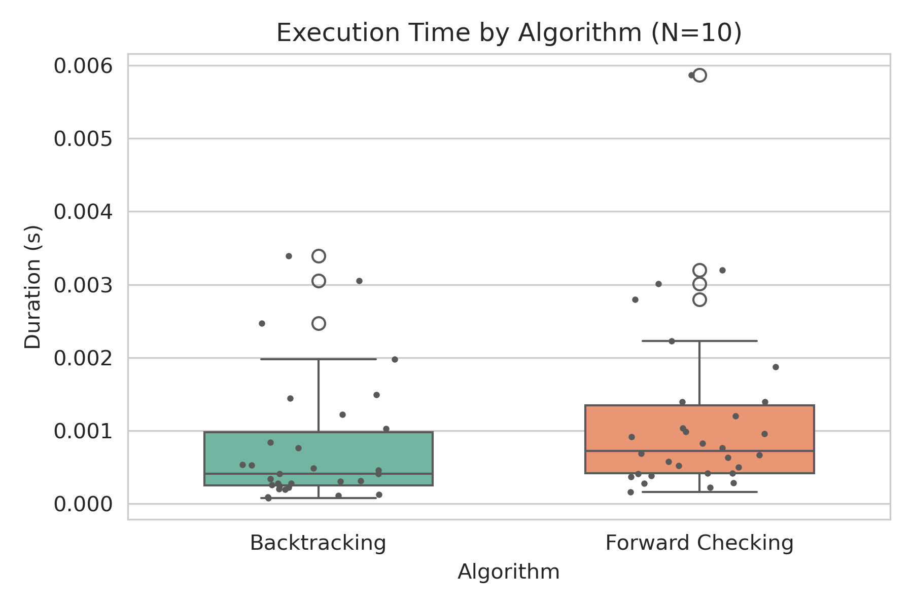
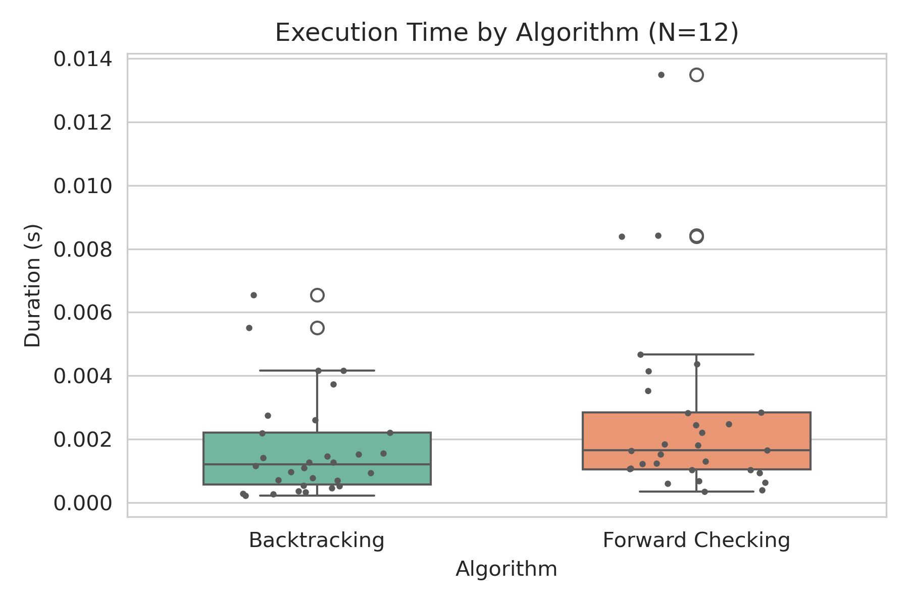
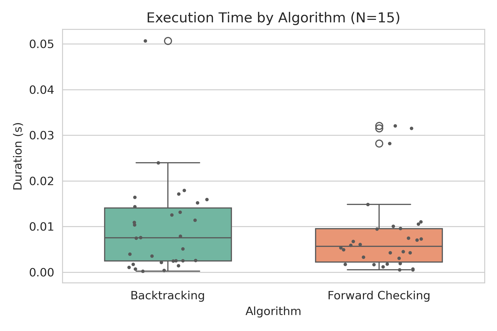
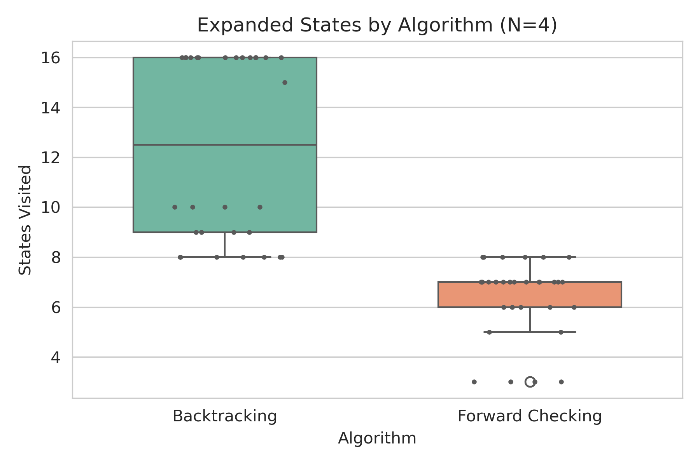
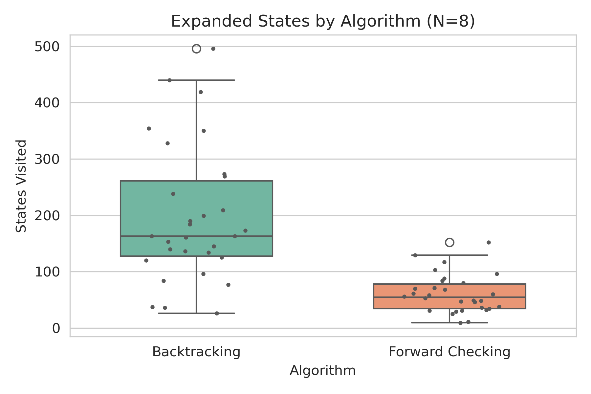
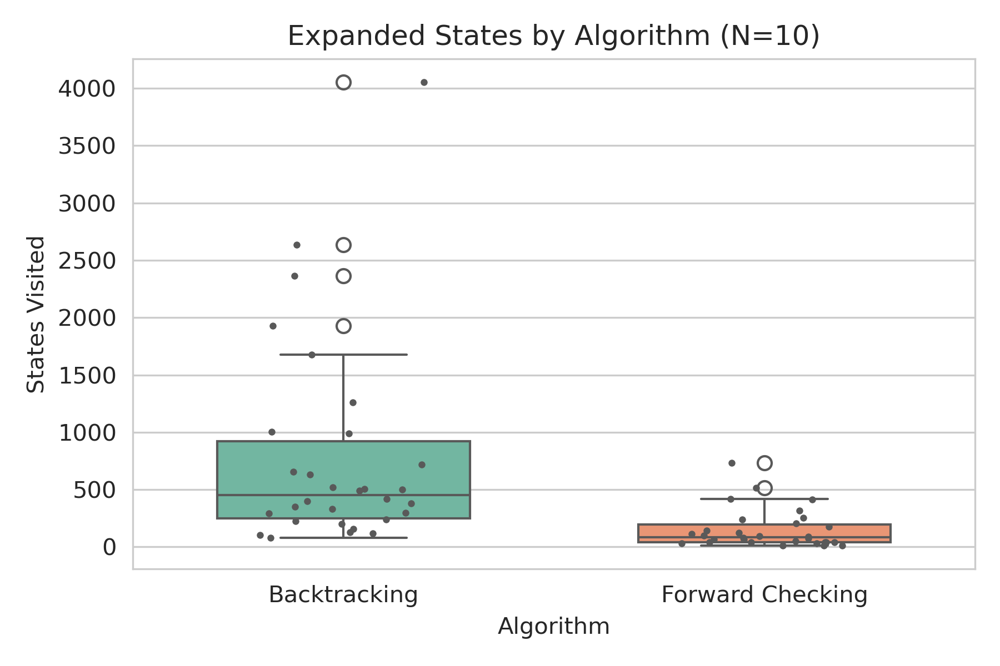
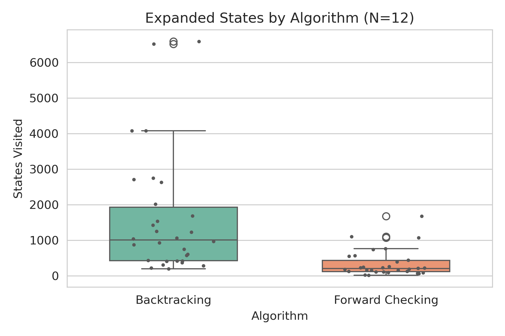
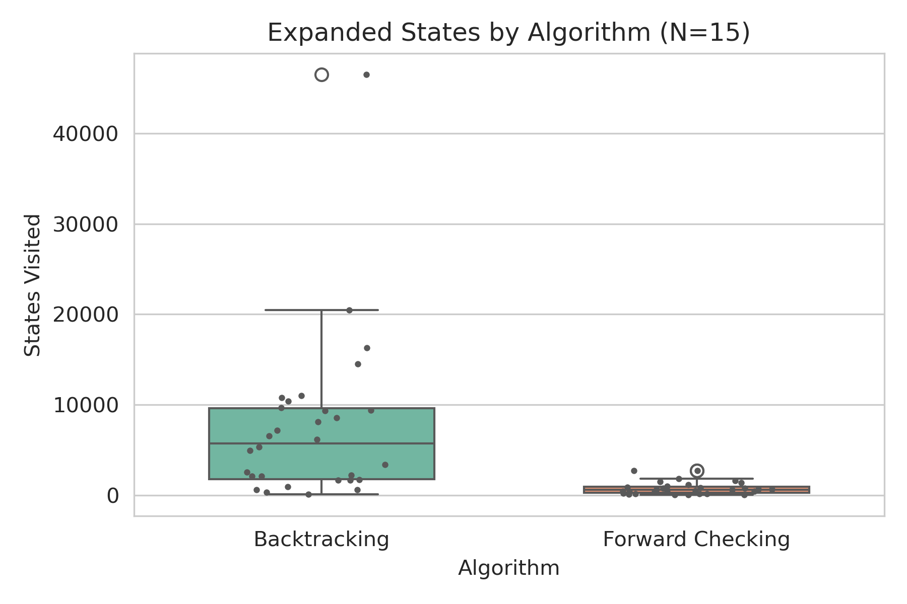

## Reporte para el Trabajo Practico 5: CSP

### Representacion del sudoku:

Para la resolucion del sudoku se supone un tablero de 9x9, donde cada casilla tiene un dominio de 9 posibilidades (del 1 al 9). Las restricciones es que dos casillas no pueden ser iguales en una linea tanto vertical o horizontal, ni en el subcuadrado (3x3) al que pertenece la casilla.

El algoritmo comenzara seleccionando una casilla, esto lo hara usando MRV, seleccionando la celda con menor opciones en el dominio (en el sudoku, empezara por aquellas casillas ya colocadas), en caso de empate puede seleccionar la que restrinja mas celdas vecinas.

Luego de seleccionar la casilla, se usara Consistencia de arco, en donde se analizaran los 20 vecinos de la casilla modificada (8 por fila + 8 por columna + 4 por subcuadrado), verificando si la solucion parcial es consistente. Esto se hara luego de cada asignacion, en caso de que no se consiga la consistencia, se hara backtrack.

Finalmente si existen casillas con un unico elemento en su dominio, se asiganara, y inmediatamente se comprabaran la consistencia de arco.

### Demostracion 

**Para esta demostracion empezamos con un estado inicial:**

D(x) = {Azul, Rojo, Verde} / x ≠ V ∧ x ≠ WA
D(WA) = {Rojo}
D(V) = {Azul}

**Aristas:**

WA → {SA, NT}
SA → {WA, NT, Q, V, NSW}
NT → {WA, SA, Q}
Q → {NT, SA, NSW}
V → {SA, NSW}
NSW → {SA, Q, V}
T → {}

**Aristas iniciales para el proceso de consistencia de arco** (aquellas que apuntan a variables ya asignadas):

(SA→WA; NT→WA; SA → V; NSW→V)

**Ejecucion de la arco consistencia**

Regla: elimina el valor z de D(X) si D(Y) = {z}

SA → WA ⇒ Elimina Rojo de D(SA)
NT → WA ⇒ Elimina Rojo de D(NT)
SA → V ⇒ Elimina Azul de D(SA)
NWS → V ⇒ Elimina Azul de D(NWS)

Como el dominio de SA ahora es unitario (SA → Verde), ahora se agregan las aristas que van desde variables no asignadas hasta SA.

NT → SA ⇒ Elimina verde de D(NT)
Q → SA ⇒ Elimina verde de D(Q)
NWS → SA ⇒ Elimina verde de D(NWS)

Como el dominio de NT y NWS ahora es unitario (NT → Azul; NWS → Rojo), ahora se agregan las aristas que van desde variables no asignadas hasta ambas variables nombradas.

Q → NT ⇒ Elimina azul de D(Q)
Q → NWS ⇒ Elimina rojo de D(Q)

Finalmente D(Q) = {}, por lo que el proceso de arco consistencia encontro la inconsistencia

### Complejidad de AC-3 en un arbol estructurado

Para empezar a hablar sobre la complejidad de la arco consistencia en un CSP el cual tiene forma de arbol empezaremos analizando el algoritmo de AC-3:

Se define la lista inicial de aristas, al ser un arbol el numero de aristas sera (n-1), siendo n el numero de nodos.

Estas aristas como maximo pueden ser encoladas otra vez un numero maximo d de veces (una encolacion por cada posible valor eliminado del nodo origen).

En este momento tenemos una complejidad de
O((n-1)d)

Luego para cada arista (Xi → Xj) se analiza la consistencia, este procedimiento asigna todos los valores posibles a Xi, con cada posible valor en Xj, eliminando aquellos que son consistentes. Este paso tiene un costo de O(d²)

Finalmente se obtiene una complejidad de **O((n-1)d³)**.

### Estrategias de resolución para N-Reinas

Para el abordaje del problema de las n reinas se diseñaron dos variantes de búsqueda informada sobre el mismo modelo CSP. En ambos casos el tablero se representa con una variable por columna, cuyos dominios son las filas disponibles, y se parte de un estado inicial en el que un subconjunto de columnas queda fijado consistentemente. Esta preasignación se genera de forma reproducible a partir de una semilla y reduce la profundidad efectiva del árbol de búsqueda sin comprometer la generalidad del algoritmo.

La primera implementación (`tp5-csp/code/backtracking.py`) sigue un backtracking clásico con asignación incremental. Cada paso selecciona la siguiente columna sin heurísticas adicionales y prueba sus valores respetando las restricciones de filas y diagonales. Aunque el recorrido es determinista, el estado inicial puede incorporar columnas fijadas al azar (controladas por la semilla), lo que permite estudiar cómo cambian los tiempos de resolución cuando se parte de configuraciones parciales distintas.

La segunda variante (`tp5-csp/code/forward.py`) incorpora heurísticas de ordenamiento y poda. Se aplica Minimum Remaining Values (MRV) para escoger la columna con menor dominio disponible y, dentro de ella, Least Constraining Value (LCV) para priorizar las filas que afectan a menos vecinos. Tras cada asignación se ejecuta forward checking: se clonan los dominios y se eliminan valores incompatibles en las columnas no asignadas; si algún dominio queda vacío, la rama se descarta inmediatamente. Esta combinación de filtrado y heurísticas reduce significativamente la cantidad de estados explorados frente al backtracking básico y permite comparar ambas aproximaciones bajo las mismas condiciones experimentales.

### Análisis de resultados experimentales

Se realizaron corridas repetidas para cada tamaño de tablero (N ∈ {4,8,10,12,15}) y algoritmo, registrando duración y cantidad de estados expandidos. Los resultados se resumen en boxplots separados por tamaño (`tp5-csp/images/boxplot_time_size_*.png` y `tp5-csp/images/boxplot_states_size_*.png`).

### Tiempos de ejecución en los resultados

En tableros pequeños como N=4, el backtracking puro suele ser ligeramente más veloz: el espacio de búsqueda es reducido y el overhead de las heurísticas del forward checking no se amortiza. A partir de N=8 la tendencia se invierte con claridad: los boxplots de duración exhiben colas mucho más largas para backtracking, mientras que forward checking mantiene medianas y dispersión acotadas. Para N=12 y N=15 el tiempo requerido por backtracking crece de forma casi explosiva, volviéndose poco práctico, mientras que forward checking continúa resolviendo en tiempos manejables.

### Estados recorridos en los resultados

Forward checking visita muchas menos configuraciones parciales: la propagación anticipada podando dominios evita expandir ramas inconsistentes, de modo que el árbol de búsqueda es considerablemente menos frondoso. En contraste, el backtracking debe recorrer la mayor parte del árbol antes de encontrar una asignación válida, lo que provoca un incremento drástico en estados explorados y, por ende, en tiempo de ejecución a medida que crece N.

### Comparación con los algoritmos del TP4

En el trabajo práctico anterior se analizaron cuatro enfoques de búsqueda local sobre N-Reinas (Hill Climbing, Simulated Annealing, Algoritmo Genético y búsqueda aleatoria). Aquellos métodos operan sobre configuraciones completas: generan vecinos, aceptan o rechazan movimientos según una función heurística y dependen de parámetros como temperatura, tasa de mutación para no atascarse en mesetas. Las gráficas de éxito y boxplots del TP4 mostraban que, a medida que el tablero crecía, la variabilidad se disparaba y el éxito dejaba de estar garantizado salvo para Simulated Annealing, que aun así requería tiempos mayores y calibración cuidadosa en N grandes.

El enfoque de CSP implementado en este TP5 introduce un contraste interesante. Backtracking puro mantiene la completitud pero escala peor que las mejores búsquedas locales, cayendo en tiempos impracticables para N ≥ 12. Sin embargo, la versión con forward checking y heurísticas MRV/LCV combina la garantía de encontrar solución con un rendimiento muy cercano (y en varios casos superior) al de los algoritmos estocásticos del TP4. Las métricas agregadas (`tp5-csp/code/data_obtained.csv`) reflejan tasas de éxito del 100 % y dispersiones bajas para forward checking, mientras que en TP4 todavía se observaban ejecuciones fallidas o muy lentas en tamaños 12 y 15.

En síntesis, los experimentos del TP4 demostraron que las búsquedas locales bien parametrizadas son una alternativa rápida cuando se tolera cierta probabilidad de fallo. Los resultados del TP5 confirman que, si añadimos poda agresiva y buenas heurísticas a la formulación como CSP, es posible obtener la robustez de un algoritmo completo sin renunciar a tiempos competitivos. Esta comparación enfatiza la importancia de combinar ideas: la preasignación aleatoria pero consistente, el desempate heurístico y la propagación anticipada acercan el comportamiento del forward checking al de los mejores métodos locales, mientras que conservan la seguridad de hallar una solución cuando existe.

