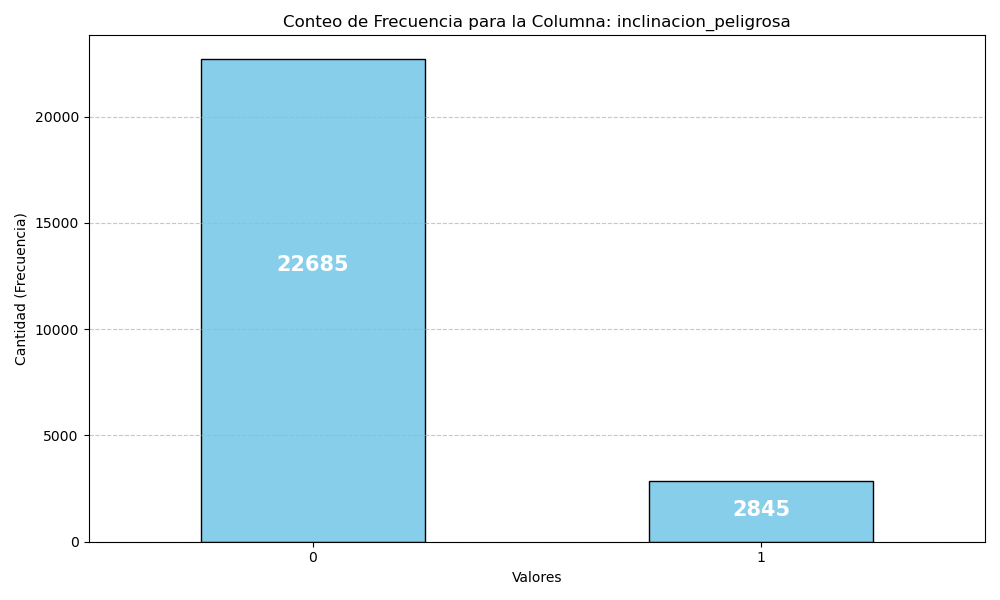
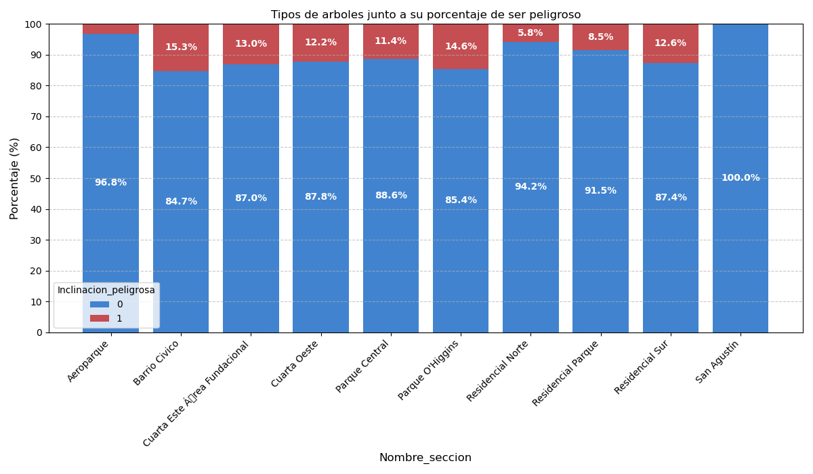
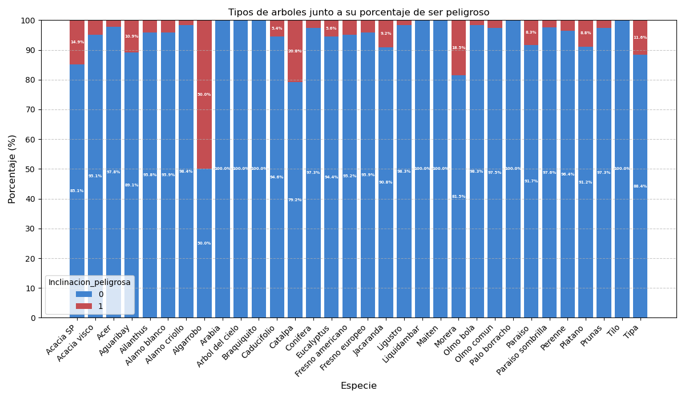
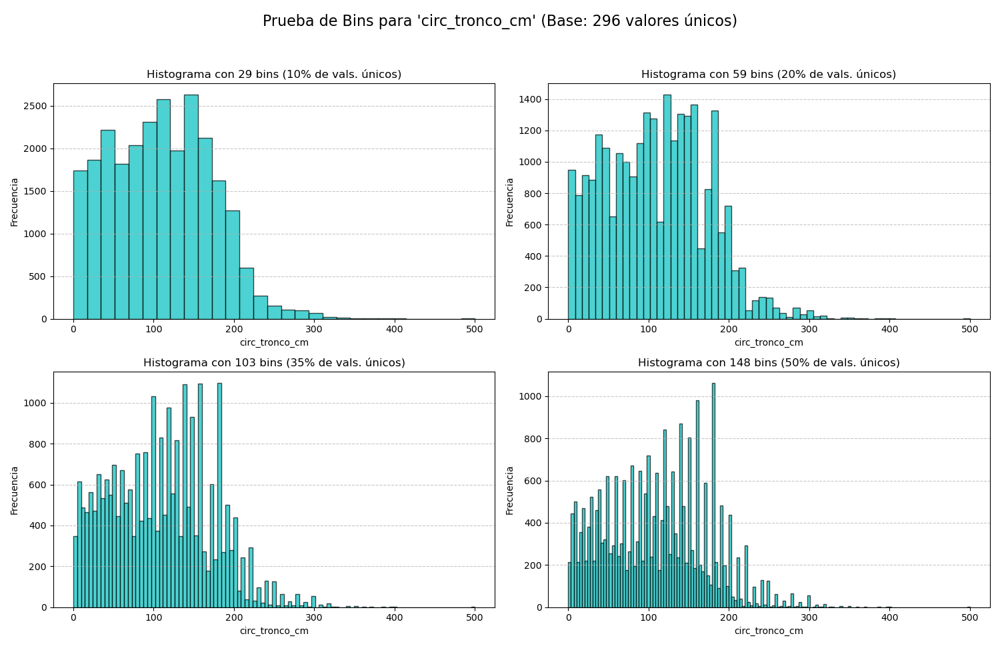
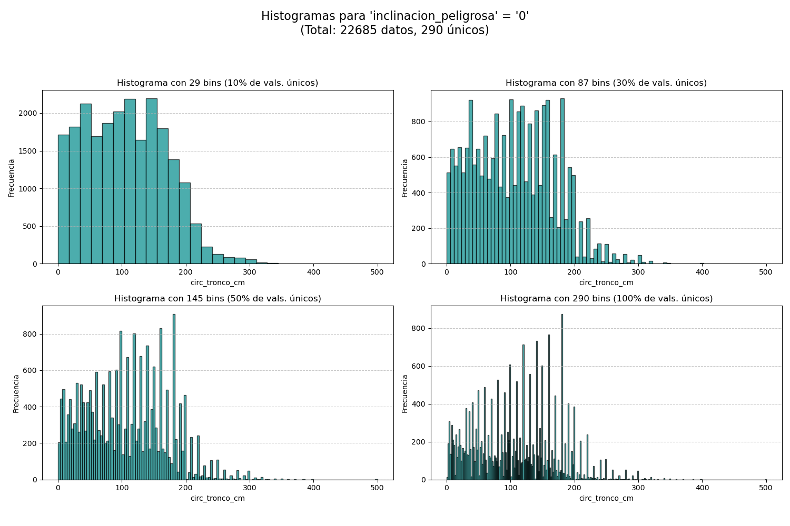
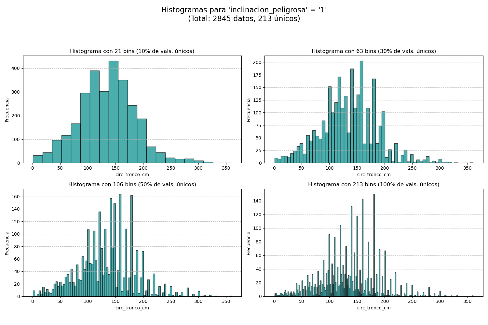

## Ejercicio 2

### Distrubucion de la categoria 'inclinacion peligrosa'

La distribución de la clase `inclinacion_peligrosa` está **altamente desbalanceada**. El gráfico de frecuencias muestra que la clase `0` (no peligrosa) es la predominante con **22,685** registros, mientras que la clase `1` (peligrosa) solo cuenta con **2,845** registros.

### ¿Se puede considerar alguna sección más peligrosa que otra?

Sí, segun los datos, algunas secciones son mas peligrosas que otras. El gráfico de porcentaje por sección muestra diferencias claras. Las secciones **'Barrio Cívico' (15.3%)** y **'Parque O'Higgins' (14.6%)** presentan el mayor porcentaje de árboles peligrosos (clase `1`).

En contraste, secciones como **'San Agustín'** tienen un 0% de árboles peligrosos (100% en clase `0`) y **'Aeroparque'** tiene un porcentaje muy bajo (3.2%).

### ¿Se puede considerar alguna especie más peligrosa que otra?

Si, segun los datos, algunas especies son mas peligrosas. El grafico muestra a la mas peligrosa como el **Algarrobo**, pero unicamente existen 4 ejemplares del mismo en el conjunto de datos de entrenamiento, por lo que no se podria decir con seguridad que el Algarrobo es mas peligroso que los otros.

Siguiendo con los mas peligrosos se encuentra el **'Capalta'** y **'Morera'**, los cuales se acercan mas al 20% de ser peligroso.

Los demas mayormente bajan del 7% de ser peligroso, por lo que se pueden considerar bastante seguros.

## Ejercicio 3

### Histograma de frecuencia para la variable 'circ_tronco_cm'

Se generaron los siguientes histogramas, siguiendo la logica de cierto porcentaje de los valores unicos existentes en la columna, es decir, si los valores fueran de 1cm a 100cm, habrian 100 valores, y se realizaran graficos con 10 (10% del total), 20 (20% del total), 35 (35% del total) o 50 bins (50% del total).

### Histograma de frecuencia para la variable 'circ_tronco_cm', restringida a la variable inclinacion peligrosa

En estos histogramas se realizo lo mismo que el inciso anterior, pero los valores utilizados fueron restringidos a si tenian una inclinacion peligrosa o no. Se obtuvieron los siguientes resultados:

Se puede ver que hay una relacion, en donde al ser un tronco mas ancho, mas probable es que este sea peligroso.
